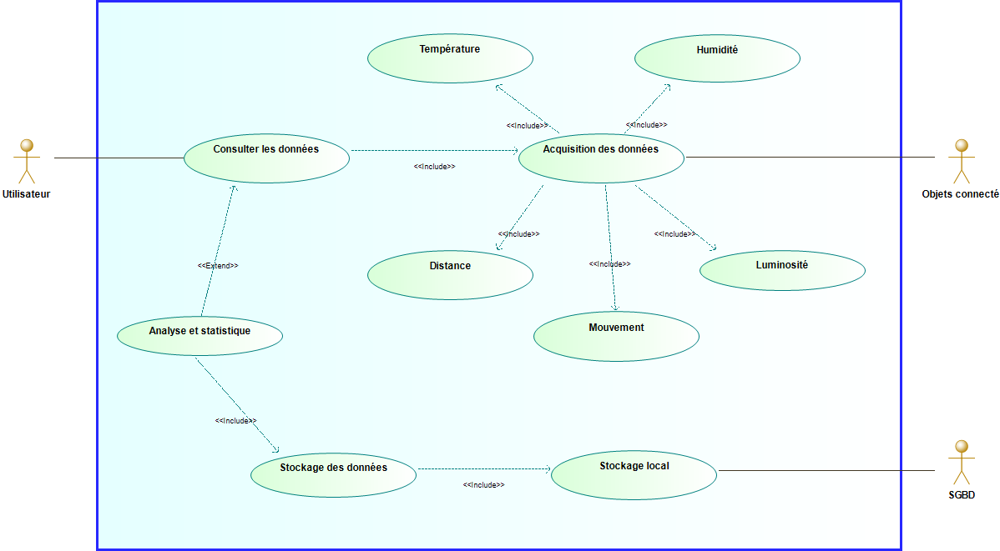
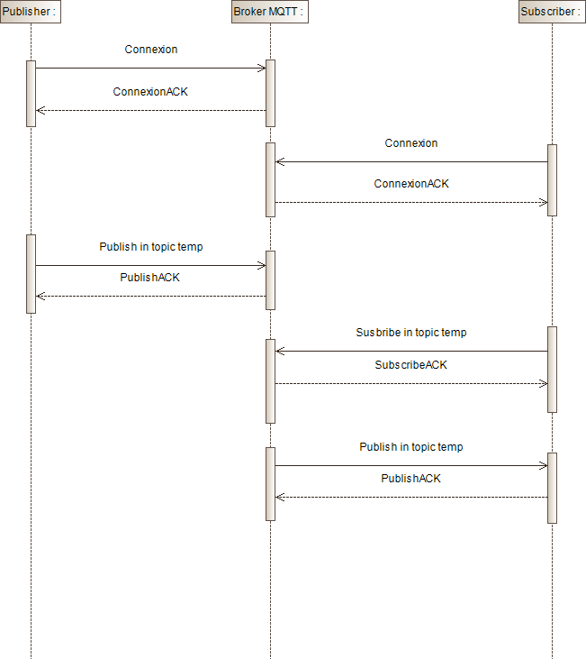
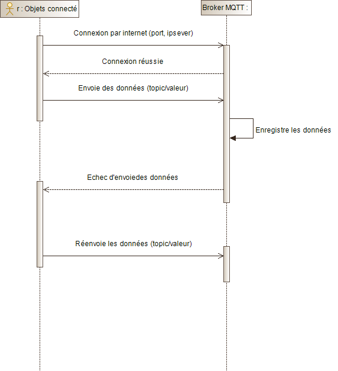
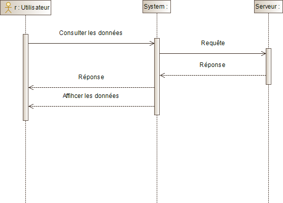
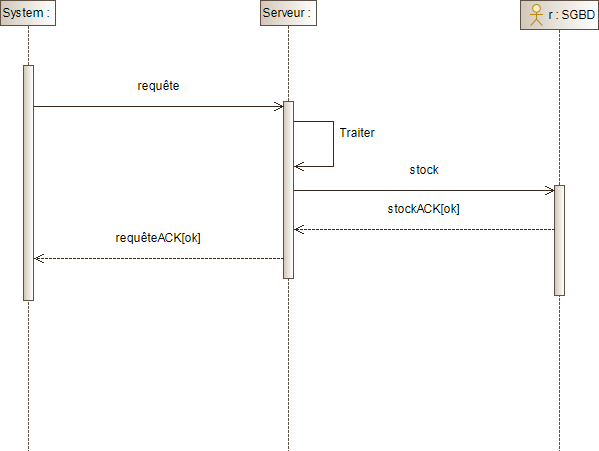

# SmartVilla

# Tutoriel Arduino

Guide d'utilisation des capteurs arduino

## Pour commencer

Une rapide définition de l’ IOT :Dispositif pour lequel les objets conçus par l’homme sont relié à internet. Ces objets se voient attribuer des identifiants uniques leur permettant de transmettre des données sur le ré-seau internet sans nécessiter aucune action humain à humain ou humain à machine. 

De manière générale, l’IoT est important dans la création d’une infra-structure intelligente pour administrer, servir et accompagner la population urbaine en constante augmentation. Une ville intelligente (SMART CITY) a besoin d’une efficacité dans différents domaines tels que :
  — les transports et la mobilité,
  — la communication,
  — les services,
  — la sécurité,
  — la communication,
  — la relation citoyenne

Les applications IoT dans la ville permettent notamment d’optimiser :
  — La performance des bâtiments,
  — les consommations d’énergie,
  — la gestion du mobilier urbain,
  — l’élimination des déchets.
  — Les consommations d’énergie,
  — la mobilité

Les bénéficiaires engendrés de ces dispositifs sont nombreux :

  — les consommateurs,
  — les citoyens,
  — les institutions territoriales
  — les entreprises privées.

Deux démarches distinctes et pourquoi pas complémentaires
  — L’approche par l’IoT qui sous-entend d’optimiser la gestion de la ville par l’administration.
  — L’approche par les applications, une approche qui se veut participative.

Elle consiste à associer le citoyen à la gestion de la cité. Grâce à l’IOT on peut en connectant les objets, les rendre créateurs de valeur. 

Ces objets pouvant s’intégrer dans des plateformes de relever per-mettent d’éviter tout un renouvellement complet d’un parc matériel. Ici,pour la gestion de déchets ont peut ajouter des capteurs aux poubelles sans remplacer les poubelles existantes. Ceci permet donc de réaliser des éco-nomies importantes. On peut dire qu’il y a autant d’objets que d’usages possibles dans l’Internet des objets.

### Prérequies

- scénario :

- Diagramme de cas d'utilisation du système

- Diagramme de séquence : protocoleMQTT

- Diagramme de séquence : Acquisition des données

- Diagramme de séquence : Consultation des données

- Diagramme de séquence : Stockage des données
 
 
